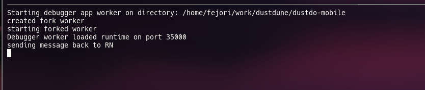

<h1 align="center">Welcome to NVIM Dap React Native 👋</h1>
<p>
  
  <a href="https://github.com/microsoft/vscode-react-native#readme" target="_blank">
    
  </a>
  <a href="https://github.com/microsoft/vscode-react-native/graphs/commit-activity" target="_blank">
    
  </a>
  <a href="https://github.com/microsoft/vscode-react-native/blob/master/LICENSE" target="_blank">
    
  </a>
</p>

> Standalone debug adapter protocol for react native. Hopefully won't have any specific editor/ide stuff

## Install

```sh
git clone git@github.com:jim-at-jibba/nvim-dap-reactnative.git
```

## Run the debugger

1. Set up the debugger with the following configuration, your configuration may be different but the values must match.

```lua
-- using modules
M.config = {
	adapters = {
		type = "executable",
		command = "node",
		args = { dbg_path .. "vscode-node-debug2/out/src/nodeDebug.js" },
	},
	configurations = {
		{
			type = "node2",
			request = "attach",
			program = "${file}",
			cwd = fn.getcwd(),
			sourceMaps = true,
			protocol = "inspector",
			console = "integratedTerminal",
			port = 35000
		},
	},
}

-- OR
-- directly - typescript react example

dap.adapters.node2 = {
	type = "executable",
	command = "node",
	args = { os.getenv("HOME") .. "/code/utils/vscode-node-debug2/out/src/nodeDebug.js" },
}


dap.configurations.typescriptreact = {
	{
		name = "React native",
		type = "node2",
		request = "attach",
		program = "${file}",
		cwd = vim.fn.getcwd(),
		sourceMaps = true,
		protocol = "inspector",
		console = "integratedTerminal",
		port = 35000,
	},
}

```
2. Open src/standalone.ts and update your project directory paths
3. Run `tsc` from the debuggers directory. You will need to rerun `tsc` every time you change the project path.
4. Start react native metro bundler and make sure its running on 8081
3. Run `node src/standalone.js`
4. Now run the app in emulator, once it is running put the app into **debug** mode. Once in debug mode you should see the output in the image below in the terminal running the debugger
5. It would wait on a white screen for debugger to attach, if its not a white empty screen then something didn't go well
6. Now in neovim, setup your breakpoints and run dap continue `:lua require('dap').continue()`.
7. It should start with a debug waiting on some unknown location, ignore it and do continue `:lua require('dap').continue()`, it will again stop on another unknown location, do continue. Now it should start hitting the app's breakpoints
8. When you finish debugging, if you make code changes, don't just refresh app, close the current debug session with `:lua require('dap').close()` Open emulator and hit rr, it will refresh and wait on white screen Do dap_continue or runlast and you are good to go

### Debugger output when connected


## Author

👤 **sultanahamer**

* Github: [@sultanahamer](https://github.com/sultanahamer)

## Show your support

Give a ⭐️ if this project helped you!

